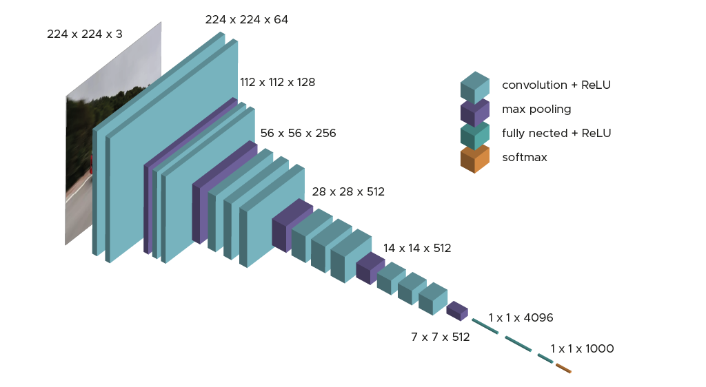

# VGG-16 from sratch to fine tunning for image classification

Dans ce sujet il s'agit d'implanter, d'entraîner et d'évaluer un réseau appelé VGG-16 pour une tâche de classification.
L'architecture de ce réseau est la suivante :

Cette architecture est composée d'une première partie convolutive qui représente l'extraction des caractéristiques et d'une
second partie totalement connectée qui assure la tâche de classification. Le schéma précédent indique pour chaque layer, le nombre de filtres ou de neurones,
le type de padding et les couches de pooling. proposés par K. Simonyan et A. Zisserman de l’université d’Oxford. Grâce à cette architecture, les auteurs ont 
gagné la compétition ILSVRC (ImageNet Large Scale Visual Recognition Challenge) en 2014 en atteignant une précision de 92.7% sur la base d'images Imagenet.
La particularité de ce réseau est qu'il est le premier à avoir proposé l'usage de noyaux de convolution de plus petites dimensions (3×3).
Pour rappell, la base d'images ImageNet est composée de 14 millions d'images classées en 1000 classes. Ce sont des images RGB de résolution 224x224.

Dans ce sujet, nous présenterons deux manières d'entraîner cette architercture de réseau. La première est dite 'training from scratch' i.e. à partir d'un réseau initialisé
avec des poids et des paramètres de filtres aléatoires. La seconde fait appel à une méthode dite de 'fine tuning'. Nous utiliserons la base d'images CIFAR-100.

Dans ce sujet, vous serez moins guidés que dans les sujets précédents. Seules les nouveautés ou les parties de script un peu délicats vous seront présentées. 
Il s'agit pour vous d'aller rechercher les éléments rencontrés dans les 3 sujets précédents pour réaliser ce travail. Par ailleurs, à vous désormais d'importer les librairies
requises pour développer votre script.

## Entrainement 'from scratch'

### Etape 1 : Définition du modèle VGG-16

**Question : à partir du schéma précédent, définir le modèle VGG-16 à l'aide des instructions Keras dont vous avez désormais connaissance.**

